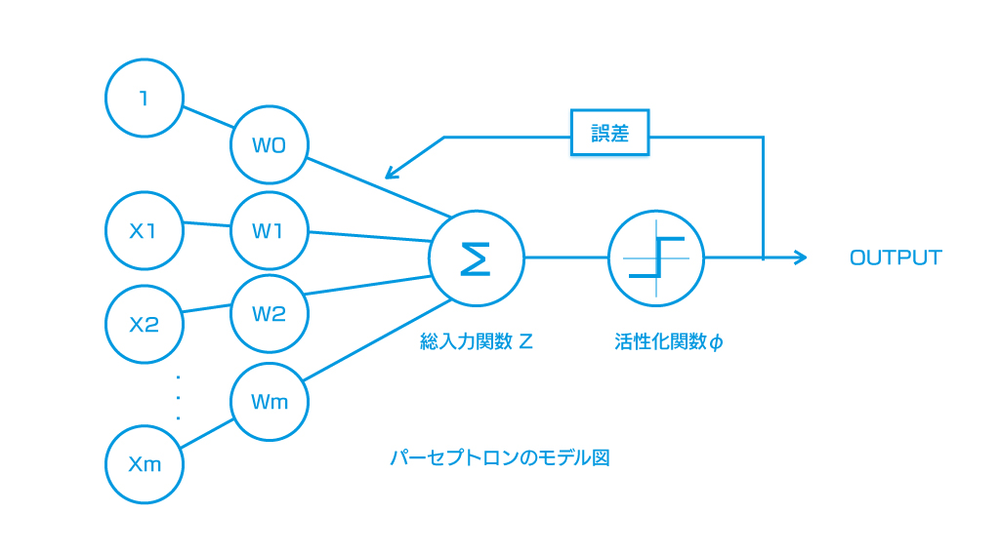
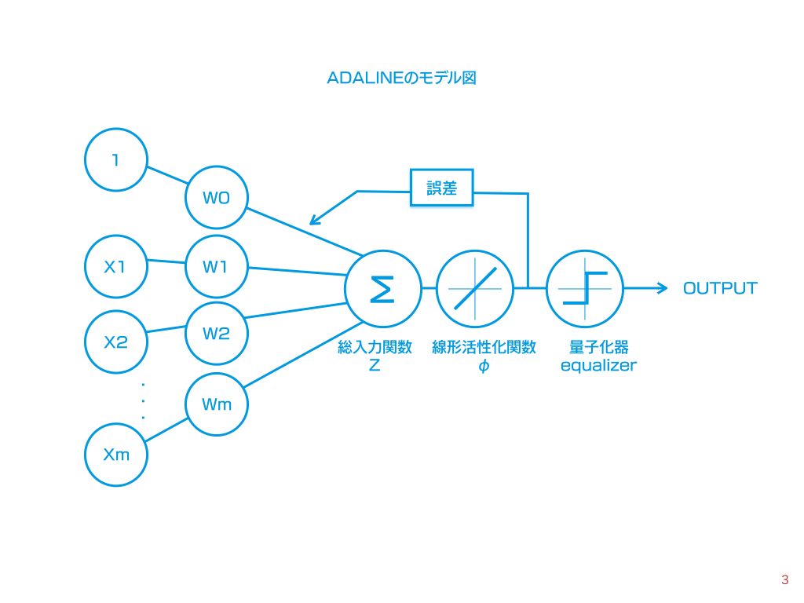
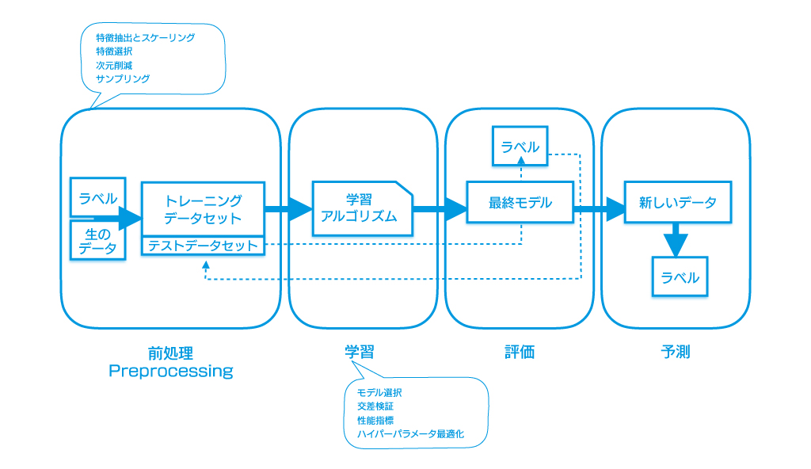

機械学習・ディープラーニングについての研究考察

## 機械学習の種類

* 教師なし学習(Supervised Learning)
* 教師あり学習(Unsupervised Learning)
* 強化学習(Reinforcement Learning)

　　
-----------------------

### 教師あり学習(Unsupervised Learning)
#### 1)離散値 : 分類(Classification)
- 初期のアルゴリズム
    - MCPニューロン(Formal neuron, 形式ニューロン）
        1943年、Warren McCullochとWalter Pittsによる世界初の神経モデル。
        特徴は 「二値出力の単純な論理ゲート」
            
    - パーセプトロン(Perceptron)
        1957年にFrank RosenblattがMCPから考え出した学習規則。
        二値分類タスクである。
        
        > X : 特定の入力行列(N, D)
        > W : 重みベクトル(D, M) 
        > 活性化関数phiへの総入力(net input): z = X.dot(W)
        > phi(z) = 1 if z >= 0 else -1
        > ※これは「発火するかしないか」という要素還元主義的アプローチ。
        > これを学習率η(<=1.0)による「学習」に適用する。
        > Δw = η X.T.dot(T - Y) 
        > T :（トレーニング用）本当のクラスラベル
        > Y : 予測されたクラスラベル
        
        
    - ADALINE(Adaptive Linear)
        1960年にパーセプトロンの改良版としてBernard Widrowらが発表。
        →「コスト関数」が始めた導入された。
        →パーセプトロンとの違いは、線形活性化関数によって重みが更新されること。
        →すべての重みを同時に更新する「バッチ勾配降下法」なのでforループをではなく、ベクトルでまとめて計算できる！
        
        勾配降下法(Gradient Descent)：目的関数（コスト関数）を最小化する。
        計算結果とクラスラベルの誤差平方和(SSE)
        > cost = ((T - Y).T.dot(T - Y)) / 2.0
        >  Δw = η X.T.dot(T - Y)
        
        
        パーセプトロンのように、ここのトレーニングサンプルを評価した後に重みを更新するのではなく、
        トレーニングデータセット全体を用いて勾配を計算する。
        
        確率的勾配降下法(Stochastic Gradient Descent)：大量データの扱いと誤差局面からの脱出に有利なノイズ
        → エポックごとにトレーニングデータをシャッフルしてランダムに並び替えるのが鍵。
        → 新しいトレーニングデータがきたらその場で学習させることができる（オンライン学習と呼ぶ）
        → 重みは最初帰化を行わない。
        
- scikit-learnの利用
    - 分類アルゴリズムの選択
        機械学習アルゴリズムのトレーニング
         * 特徴量選択　→　性能指標選択　→　分類器（最適化アルゴリズム）選択 → モデル性能評価 →　調整
         * sklearn.cross_validation.train_test_splitでデータセットとトレーニングとテスト用に分割する。
         * sklearn.preprocessing.StandardScalerで特徴量を標準化する。
         * sklearn.linear_model.Perceptronでパーセプトロンを実装する。

#### 2)連続値 : 回帰(Regression)

#### 分類=クラスラベルの予測
* 二値分類(Binary Classification)
* 他クラス分類(Multi-class Classification)

#### 回帰分析＝連続値を予想する
* 線形回帰(Linear Regression)など

------------------------
### 強化学習(Reinforcement Learning)
エージェント＝環境とのやりとりに基づいて性能を改善するシステム。

----------------------
### 教師なし学習(Supervised Learning)

* クラスタリング(Clustering)＝グループの発見
* 次元削減(Dimentionality Reduction)=データ圧縮

## 機械学習のワークフロー

    ステップ１（ミニバッチ）
    ステップ２（勾配の算出）
    ステップ３（パラメータの更新）→繰り返す

## 前処理：データ整形
* ハイパーパラメータ最適化
* 汎化誤差（学習時に使用しなかったデータに対する予測値と正解の差）
* スケーリング
    標準化（Standardization)：各特徴量の平均を０とし、標準偏差を１にする（統計でいうZ値にする）。
    x' = (x-μ) / σ
    
    > X_std = np.copy(X)
    > X_std[:,0] = (X[:,0] - X[:,0].mean()) / X[:,0].std()
    
   

## 使用するPythonパッケージ
* Numpy 1.9.1
* SciPy 0.14.0
* scikit-learn 0.15.2
* matplotlib 1.4.0
* pandas 0.15.2

